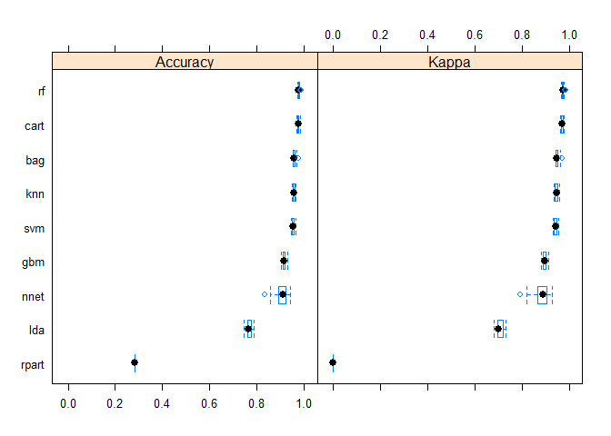

# Wearable Tech Prediction Assignment
Mark Huang  
April 21, 2017  


## Executive Summary
Using devices such as Jawbone Up, Nike FuelBand, and Fitbit it is now possible to collect a large amount of data about personal activity relatively inexpensively. In this project, we will use data from accelerometers on the belt, forearm, arm, and dumbell of 6 participants which were asked to perform barbell lifts correctly and incorrectly in 5 different ways.

The goal of this project is to predict the manner in which they did the exercise.
This is the **classe** variable in the training set. We attempt to train a couple of models and pick the best ones to predict the **casse** variable in the testing set.

## Data Sources
The training and testing datasets can be download from the locations below.

https://d396qusza40orc.cloudfront.net/predmachlearn/pml-training.csv

https://d396qusza40orc.cloudfront.net/predmachlearn/pml-testing.csv

We attempt to download the above two files to load locally.


```r
urlTrain <- "https://d396qusza40orc.cloudfront.net/predmachlearn/pml-training.csv"
urlTest <- "https://d396qusza40orc.cloudfront.net/predmachlearn/pml-testing.csv"
```

## Loading Data
Before we begin, let's load all the necessary libraries we need to model.


```r
library(caret)
```

```
## Loading required package: lattice
```

```
## Loading required package: ggplot2
```

```r
library(caretEnsemble)
```

```
## 
## Attaching package: 'caretEnsemble'
```

```
## The following object is masked from 'package:ggplot2':
## 
##     autoplot
```

```r
library(mlbench)
```

Next, we attempt to load the downloaded files above in R.


```r
training = read.csv("pml-training.csv",na.strings=c("NA","#DIV/0!",""))
testing = read.csv("pml-testing.csv",na.strings=c("NA","#DIV/0!",""))
names(training)
```

```
##   [1] "X"                        "user_name"               
##   [3] "raw_timestamp_part_1"     "raw_timestamp_part_2"    
##   [5] "cvtd_timestamp"           "new_window"              
##   [7] "num_window"               "roll_belt"               
##   [9] "pitch_belt"               "yaw_belt"                
##  [11] "total_accel_belt"         "kurtosis_roll_belt"      
##  [13] "kurtosis_picth_belt"      "kurtosis_yaw_belt"       
##  [15] "skewness_roll_belt"       "skewness_roll_belt.1"    
##  [17] "skewness_yaw_belt"        "max_roll_belt"           
##  [19] "max_picth_belt"           "max_yaw_belt"            
##  [21] "min_roll_belt"            "min_pitch_belt"          
##  [23] "min_yaw_belt"             "amplitude_roll_belt"     
##  [25] "amplitude_pitch_belt"     "amplitude_yaw_belt"      
##  [27] "var_total_accel_belt"     "avg_roll_belt"           
##  [29] "stddev_roll_belt"         "var_roll_belt"           
##  [31] "avg_pitch_belt"           "stddev_pitch_belt"       
##  [33] "var_pitch_belt"           "avg_yaw_belt"            
##  [35] "stddev_yaw_belt"          "var_yaw_belt"            
##  [37] "gyros_belt_x"             "gyros_belt_y"            
##  [39] "gyros_belt_z"             "accel_belt_x"            
##  [41] "accel_belt_y"             "accel_belt_z"            
##  [43] "magnet_belt_x"            "magnet_belt_y"           
##  [45] "magnet_belt_z"            "roll_arm"                
##  [47] "pitch_arm"                "yaw_arm"                 
##  [49] "total_accel_arm"          "var_accel_arm"           
##  [51] "avg_roll_arm"             "stddev_roll_arm"         
##  [53] "var_roll_arm"             "avg_pitch_arm"           
##  [55] "stddev_pitch_arm"         "var_pitch_arm"           
##  [57] "avg_yaw_arm"              "stddev_yaw_arm"          
##  [59] "var_yaw_arm"              "gyros_arm_x"             
##  [61] "gyros_arm_y"              "gyros_arm_z"             
##  [63] "accel_arm_x"              "accel_arm_y"             
##  [65] "accel_arm_z"              "magnet_arm_x"            
##  [67] "magnet_arm_y"             "magnet_arm_z"            
##  [69] "kurtosis_roll_arm"        "kurtosis_picth_arm"      
##  [71] "kurtosis_yaw_arm"         "skewness_roll_arm"       
##  [73] "skewness_pitch_arm"       "skewness_yaw_arm"        
##  [75] "max_roll_arm"             "max_picth_arm"           
##  [77] "max_yaw_arm"              "min_roll_arm"            
##  [79] "min_pitch_arm"            "min_yaw_arm"             
##  [81] "amplitude_roll_arm"       "amplitude_pitch_arm"     
##  [83] "amplitude_yaw_arm"        "roll_dumbbell"           
##  [85] "pitch_dumbbell"           "yaw_dumbbell"            
##  [87] "kurtosis_roll_dumbbell"   "kurtosis_picth_dumbbell" 
##  [89] "kurtosis_yaw_dumbbell"    "skewness_roll_dumbbell"  
##  [91] "skewness_pitch_dumbbell"  "skewness_yaw_dumbbell"   
##  [93] "max_roll_dumbbell"        "max_picth_dumbbell"      
##  [95] "max_yaw_dumbbell"         "min_roll_dumbbell"       
##  [97] "min_pitch_dumbbell"       "min_yaw_dumbbell"        
##  [99] "amplitude_roll_dumbbell"  "amplitude_pitch_dumbbell"
## [101] "amplitude_yaw_dumbbell"   "total_accel_dumbbell"    
## [103] "var_accel_dumbbell"       "avg_roll_dumbbell"       
## [105] "stddev_roll_dumbbell"     "var_roll_dumbbell"       
## [107] "avg_pitch_dumbbell"       "stddev_pitch_dumbbell"   
## [109] "var_pitch_dumbbell"       "avg_yaw_dumbbell"        
## [111] "stddev_yaw_dumbbell"      "var_yaw_dumbbell"        
## [113] "gyros_dumbbell_x"         "gyros_dumbbell_y"        
## [115] "gyros_dumbbell_z"         "accel_dumbbell_x"        
## [117] "accel_dumbbell_y"         "accel_dumbbell_z"        
## [119] "magnet_dumbbell_x"        "magnet_dumbbell_y"       
## [121] "magnet_dumbbell_z"        "roll_forearm"            
## [123] "pitch_forearm"            "yaw_forearm"             
## [125] "kurtosis_roll_forearm"    "kurtosis_picth_forearm"  
## [127] "kurtosis_yaw_forearm"     "skewness_roll_forearm"   
## [129] "skewness_pitch_forearm"   "skewness_yaw_forearm"    
## [131] "max_roll_forearm"         "max_picth_forearm"       
## [133] "max_yaw_forearm"          "min_roll_forearm"        
## [135] "min_pitch_forearm"        "min_yaw_forearm"         
## [137] "amplitude_roll_forearm"   "amplitude_pitch_forearm" 
## [139] "amplitude_yaw_forearm"    "total_accel_forearm"     
## [141] "var_accel_forearm"        "avg_roll_forearm"        
## [143] "stddev_roll_forearm"      "var_roll_forearm"        
## [145] "avg_pitch_forearm"        "stddev_pitch_forearm"    
## [147] "var_pitch_forearm"        "avg_yaw_forearm"         
## [149] "stddev_yaw_forearm"       "var_yaw_forearm"         
## [151] "gyros_forearm_x"          "gyros_forearm_y"         
## [153] "gyros_forearm_z"          "accel_forearm_x"         
## [155] "accel_forearm_y"          "accel_forearm_z"         
## [157] "magnet_forearm_x"         "magnet_forearm_y"        
## [159] "magnet_forearm_z"         "classe"
```

```r
names(testing)
```

```
##   [1] "X"                        "user_name"               
##   [3] "raw_timestamp_part_1"     "raw_timestamp_part_2"    
##   [5] "cvtd_timestamp"           "new_window"              
##   [7] "num_window"               "roll_belt"               
##   [9] "pitch_belt"               "yaw_belt"                
##  [11] "total_accel_belt"         "kurtosis_roll_belt"      
##  [13] "kurtosis_picth_belt"      "kurtosis_yaw_belt"       
##  [15] "skewness_roll_belt"       "skewness_roll_belt.1"    
##  [17] "skewness_yaw_belt"        "max_roll_belt"           
##  [19] "max_picth_belt"           "max_yaw_belt"            
##  [21] "min_roll_belt"            "min_pitch_belt"          
##  [23] "min_yaw_belt"             "amplitude_roll_belt"     
##  [25] "amplitude_pitch_belt"     "amplitude_yaw_belt"      
##  [27] "var_total_accel_belt"     "avg_roll_belt"           
##  [29] "stddev_roll_belt"         "var_roll_belt"           
##  [31] "avg_pitch_belt"           "stddev_pitch_belt"       
##  [33] "var_pitch_belt"           "avg_yaw_belt"            
##  [35] "stddev_yaw_belt"          "var_yaw_belt"            
##  [37] "gyros_belt_x"             "gyros_belt_y"            
##  [39] "gyros_belt_z"             "accel_belt_x"            
##  [41] "accel_belt_y"             "accel_belt_z"            
##  [43] "magnet_belt_x"            "magnet_belt_y"           
##  [45] "magnet_belt_z"            "roll_arm"                
##  [47] "pitch_arm"                "yaw_arm"                 
##  [49] "total_accel_arm"          "var_accel_arm"           
##  [51] "avg_roll_arm"             "stddev_roll_arm"         
##  [53] "var_roll_arm"             "avg_pitch_arm"           
##  [55] "stddev_pitch_arm"         "var_pitch_arm"           
##  [57] "avg_yaw_arm"              "stddev_yaw_arm"          
##  [59] "var_yaw_arm"              "gyros_arm_x"             
##  [61] "gyros_arm_y"              "gyros_arm_z"             
##  [63] "accel_arm_x"              "accel_arm_y"             
##  [65] "accel_arm_z"              "magnet_arm_x"            
##  [67] "magnet_arm_y"             "magnet_arm_z"            
##  [69] "kurtosis_roll_arm"        "kurtosis_picth_arm"      
##  [71] "kurtosis_yaw_arm"         "skewness_roll_arm"       
##  [73] "skewness_pitch_arm"       "skewness_yaw_arm"        
##  [75] "max_roll_arm"             "max_picth_arm"           
##  [77] "max_yaw_arm"              "min_roll_arm"            
##  [79] "min_pitch_arm"            "min_yaw_arm"             
##  [81] "amplitude_roll_arm"       "amplitude_pitch_arm"     
##  [83] "amplitude_yaw_arm"        "roll_dumbbell"           
##  [85] "pitch_dumbbell"           "yaw_dumbbell"            
##  [87] "kurtosis_roll_dumbbell"   "kurtosis_picth_dumbbell" 
##  [89] "kurtosis_yaw_dumbbell"    "skewness_roll_dumbbell"  
##  [91] "skewness_pitch_dumbbell"  "skewness_yaw_dumbbell"   
##  [93] "max_roll_dumbbell"        "max_picth_dumbbell"      
##  [95] "max_yaw_dumbbell"         "min_roll_dumbbell"       
##  [97] "min_pitch_dumbbell"       "min_yaw_dumbbell"        
##  [99] "amplitude_roll_dumbbell"  "amplitude_pitch_dumbbell"
## [101] "amplitude_yaw_dumbbell"   "total_accel_dumbbell"    
## [103] "var_accel_dumbbell"       "avg_roll_dumbbell"       
## [105] "stddev_roll_dumbbell"     "var_roll_dumbbell"       
## [107] "avg_pitch_dumbbell"       "stddev_pitch_dumbbell"   
## [109] "var_pitch_dumbbell"       "avg_yaw_dumbbell"        
## [111] "stddev_yaw_dumbbell"      "var_yaw_dumbbell"        
## [113] "gyros_dumbbell_x"         "gyros_dumbbell_y"        
## [115] "gyros_dumbbell_z"         "accel_dumbbell_x"        
## [117] "accel_dumbbell_y"         "accel_dumbbell_z"        
## [119] "magnet_dumbbell_x"        "magnet_dumbbell_y"       
## [121] "magnet_dumbbell_z"        "roll_forearm"            
## [123] "pitch_forearm"            "yaw_forearm"             
## [125] "kurtosis_roll_forearm"    "kurtosis_picth_forearm"  
## [127] "kurtosis_yaw_forearm"     "skewness_roll_forearm"   
## [129] "skewness_pitch_forearm"   "skewness_yaw_forearm"    
## [131] "max_roll_forearm"         "max_picth_forearm"       
## [133] "max_yaw_forearm"          "min_roll_forearm"        
## [135] "min_pitch_forearm"        "min_yaw_forearm"         
## [137] "amplitude_roll_forearm"   "amplitude_pitch_forearm" 
## [139] "amplitude_yaw_forearm"    "total_accel_forearm"     
## [141] "var_accel_forearm"        "avg_roll_forearm"        
## [143] "stddev_roll_forearm"      "var_roll_forearm"        
## [145] "avg_pitch_forearm"        "stddev_pitch_forearm"    
## [147] "var_pitch_forearm"        "avg_yaw_forearm"         
## [149] "stddev_yaw_forearm"       "var_yaw_forearm"         
## [151] "gyros_forearm_x"          "gyros_forearm_y"         
## [153] "gyros_forearm_z"          "accel_forearm_x"         
## [155] "accel_forearm_y"          "accel_forearm_z"         
## [157] "magnet_forearm_x"         "magnet_forearm_y"        
## [159] "magnet_forearm_z"         "problem_id"
```

Notice from above that the ```training``` dataset had the **classe** variable whereas the ```testing``` dataset has the **problem_id** variable instead. The former variable is the value we want to predict with our model, while the latter variable identifies the **problem_id** to submit in the **20** question quiz later.

## Data Profiling
To build any prediction model, we need to understand the structure of our data. From the code below, we observe that many variables have **NA** values that we should omit from our training data.


```r
str(training)
```

```
## 'data.frame':	19622 obs. of  160 variables:
##  $ X                       : int  1 2 3 4 5 6 7 8 9 10 ...
##  $ user_name               : Factor w/ 6 levels "adelmo","carlitos",..: 2 2 2 2 2 2 2 2 2 2 ...
##  $ raw_timestamp_part_1    : int  1323084231 1323084231 1323084231 1323084232 1323084232 1323084232 1323084232 1323084232 1323084232 1323084232 ...
##  $ raw_timestamp_part_2    : int  788290 808298 820366 120339 196328 304277 368296 440390 484323 484434 ...
##  $ cvtd_timestamp          : Factor w/ 20 levels "02/12/2011 13:32",..: 9 9 9 9 9 9 9 9 9 9 ...
##  $ new_window              : Factor w/ 2 levels "no","yes": 1 1 1 1 1 1 1 1 1 1 ...
##  $ num_window              : int  11 11 11 12 12 12 12 12 12 12 ...
##  $ roll_belt               : num  1.41 1.41 1.42 1.48 1.48 1.45 1.42 1.42 1.43 1.45 ...
##  $ pitch_belt              : num  8.07 8.07 8.07 8.05 8.07 8.06 8.09 8.13 8.16 8.17 ...
##  $ yaw_belt                : num  -94.4 -94.4 -94.4 -94.4 -94.4 -94.4 -94.4 -94.4 -94.4 -94.4 ...
##  $ total_accel_belt        : int  3 3 3 3 3 3 3 3 3 3 ...
##  $ kurtosis_roll_belt      : num  NA NA NA NA NA NA NA NA NA NA ...
##  $ kurtosis_picth_belt     : num  NA NA NA NA NA NA NA NA NA NA ...
##  $ kurtosis_yaw_belt       : logi  NA NA NA NA NA NA ...
##  $ skewness_roll_belt      : num  NA NA NA NA NA NA NA NA NA NA ...
##  $ skewness_roll_belt.1    : num  NA NA NA NA NA NA NA NA NA NA ...
##  $ skewness_yaw_belt       : logi  NA NA NA NA NA NA ...
##  $ max_roll_belt           : num  NA NA NA NA NA NA NA NA NA NA ...
##  $ max_picth_belt          : int  NA NA NA NA NA NA NA NA NA NA ...
##  $ max_yaw_belt            : num  NA NA NA NA NA NA NA NA NA NA ...
##  $ min_roll_belt           : num  NA NA NA NA NA NA NA NA NA NA ...
##  $ min_pitch_belt          : int  NA NA NA NA NA NA NA NA NA NA ...
##  $ min_yaw_belt            : num  NA NA NA NA NA NA NA NA NA NA ...
##  $ amplitude_roll_belt     : num  NA NA NA NA NA NA NA NA NA NA ...
##  $ amplitude_pitch_belt    : int  NA NA NA NA NA NA NA NA NA NA ...
##  $ amplitude_yaw_belt      : num  NA NA NA NA NA NA NA NA NA NA ...
##  $ var_total_accel_belt    : num  NA NA NA NA NA NA NA NA NA NA ...
##  $ avg_roll_belt           : num  NA NA NA NA NA NA NA NA NA NA ...
##  $ stddev_roll_belt        : num  NA NA NA NA NA NA NA NA NA NA ...
##  $ var_roll_belt           : num  NA NA NA NA NA NA NA NA NA NA ...
##  $ avg_pitch_belt          : num  NA NA NA NA NA NA NA NA NA NA ...
##  $ stddev_pitch_belt       : num  NA NA NA NA NA NA NA NA NA NA ...
##  $ var_pitch_belt          : num  NA NA NA NA NA NA NA NA NA NA ...
##  $ avg_yaw_belt            : num  NA NA NA NA NA NA NA NA NA NA ...
##  $ stddev_yaw_belt         : num  NA NA NA NA NA NA NA NA NA NA ...
##  $ var_yaw_belt            : num  NA NA NA NA NA NA NA NA NA NA ...
##  $ gyros_belt_x            : num  0 0.02 0 0.02 0.02 0.02 0.02 0.02 0.02 0.03 ...
##  $ gyros_belt_y            : num  0 0 0 0 0.02 0 0 0 0 0 ...
##  $ gyros_belt_z            : num  -0.02 -0.02 -0.02 -0.03 -0.02 -0.02 -0.02 -0.02 -0.02 0 ...
##  $ accel_belt_x            : int  -21 -22 -20 -22 -21 -21 -22 -22 -20 -21 ...
##  $ accel_belt_y            : int  4 4 5 3 2 4 3 4 2 4 ...
##  $ accel_belt_z            : int  22 22 23 21 24 21 21 21 24 22 ...
##  $ magnet_belt_x           : int  -3 -7 -2 -6 -6 0 -4 -2 1 -3 ...
##  $ magnet_belt_y           : int  599 608 600 604 600 603 599 603 602 609 ...
##  $ magnet_belt_z           : int  -313 -311 -305 -310 -302 -312 -311 -313 -312 -308 ...
##  $ roll_arm                : num  -128 -128 -128 -128 -128 -128 -128 -128 -128 -128 ...
##  $ pitch_arm               : num  22.5 22.5 22.5 22.1 22.1 22 21.9 21.8 21.7 21.6 ...
##  $ yaw_arm                 : num  -161 -161 -161 -161 -161 -161 -161 -161 -161 -161 ...
##  $ total_accel_arm         : int  34 34 34 34 34 34 34 34 34 34 ...
##  $ var_accel_arm           : num  NA NA NA NA NA NA NA NA NA NA ...
##  $ avg_roll_arm            : num  NA NA NA NA NA NA NA NA NA NA ...
##  $ stddev_roll_arm         : num  NA NA NA NA NA NA NA NA NA NA ...
##  $ var_roll_arm            : num  NA NA NA NA NA NA NA NA NA NA ...
##  $ avg_pitch_arm           : num  NA NA NA NA NA NA NA NA NA NA ...
##  $ stddev_pitch_arm        : num  NA NA NA NA NA NA NA NA NA NA ...
##  $ var_pitch_arm           : num  NA NA NA NA NA NA NA NA NA NA ...
##  $ avg_yaw_arm             : num  NA NA NA NA NA NA NA NA NA NA ...
##  $ stddev_yaw_arm          : num  NA NA NA NA NA NA NA NA NA NA ...
##  $ var_yaw_arm             : num  NA NA NA NA NA NA NA NA NA NA ...
##  $ gyros_arm_x             : num  0 0.02 0.02 0.02 0 0.02 0 0.02 0.02 0.02 ...
##  $ gyros_arm_y             : num  0 -0.02 -0.02 -0.03 -0.03 -0.03 -0.03 -0.02 -0.03 -0.03 ...
##  $ gyros_arm_z             : num  -0.02 -0.02 -0.02 0.02 0 0 0 0 -0.02 -0.02 ...
##  $ accel_arm_x             : int  -288 -290 -289 -289 -289 -289 -289 -289 -288 -288 ...
##  $ accel_arm_y             : int  109 110 110 111 111 111 111 111 109 110 ...
##  $ accel_arm_z             : int  -123 -125 -126 -123 -123 -122 -125 -124 -122 -124 ...
##  $ magnet_arm_x            : int  -368 -369 -368 -372 -374 -369 -373 -372 -369 -376 ...
##  $ magnet_arm_y            : int  337 337 344 344 337 342 336 338 341 334 ...
##  $ magnet_arm_z            : int  516 513 513 512 506 513 509 510 518 516 ...
##  $ kurtosis_roll_arm       : num  NA NA NA NA NA NA NA NA NA NA ...
##  $ kurtosis_picth_arm      : num  NA NA NA NA NA NA NA NA NA NA ...
##  $ kurtosis_yaw_arm        : num  NA NA NA NA NA NA NA NA NA NA ...
##  $ skewness_roll_arm       : num  NA NA NA NA NA NA NA NA NA NA ...
##  $ skewness_pitch_arm      : num  NA NA NA NA NA NA NA NA NA NA ...
##  $ skewness_yaw_arm        : num  NA NA NA NA NA NA NA NA NA NA ...
##  $ max_roll_arm            : num  NA NA NA NA NA NA NA NA NA NA ...
##  $ max_picth_arm           : num  NA NA NA NA NA NA NA NA NA NA ...
##  $ max_yaw_arm             : int  NA NA NA NA NA NA NA NA NA NA ...
##  $ min_roll_arm            : num  NA NA NA NA NA NA NA NA NA NA ...
##  $ min_pitch_arm           : num  NA NA NA NA NA NA NA NA NA NA ...
##  $ min_yaw_arm             : int  NA NA NA NA NA NA NA NA NA NA ...
##  $ amplitude_roll_arm      : num  NA NA NA NA NA NA NA NA NA NA ...
##  $ amplitude_pitch_arm     : num  NA NA NA NA NA NA NA NA NA NA ...
##  $ amplitude_yaw_arm       : int  NA NA NA NA NA NA NA NA NA NA ...
##  $ roll_dumbbell           : num  13.1 13.1 12.9 13.4 13.4 ...
##  $ pitch_dumbbell          : num  -70.5 -70.6 -70.3 -70.4 -70.4 ...
##  $ yaw_dumbbell            : num  -84.9 -84.7 -85.1 -84.9 -84.9 ...
##  $ kurtosis_roll_dumbbell  : num  NA NA NA NA NA NA NA NA NA NA ...
##  $ kurtosis_picth_dumbbell : num  NA NA NA NA NA NA NA NA NA NA ...
##  $ kurtosis_yaw_dumbbell   : logi  NA NA NA NA NA NA ...
##  $ skewness_roll_dumbbell  : num  NA NA NA NA NA NA NA NA NA NA ...
##  $ skewness_pitch_dumbbell : num  NA NA NA NA NA NA NA NA NA NA ...
##  $ skewness_yaw_dumbbell   : logi  NA NA NA NA NA NA ...
##  $ max_roll_dumbbell       : num  NA NA NA NA NA NA NA NA NA NA ...
##  $ max_picth_dumbbell      : num  NA NA NA NA NA NA NA NA NA NA ...
##  $ max_yaw_dumbbell        : num  NA NA NA NA NA NA NA NA NA NA ...
##  $ min_roll_dumbbell       : num  NA NA NA NA NA NA NA NA NA NA ...
##  $ min_pitch_dumbbell      : num  NA NA NA NA NA NA NA NA NA NA ...
##  $ min_yaw_dumbbell        : num  NA NA NA NA NA NA NA NA NA NA ...
##  $ amplitude_roll_dumbbell : num  NA NA NA NA NA NA NA NA NA NA ...
##   [list output truncated]
```

### NA Value Removal
We build a list of these variables that contain mostly **NA** values that we should omit.


```r
naCols <- sapply(seq_len(ncol(training)), function(x) if(sum(is.na(training[,x]))>0.5*nrow(training)) {return(TRUE)} else {return(FALSE)})
trainSmall <- training[,!naCols]
```

We don't stop here because we don't want our data to contain any columns with **NA** values. We perform a row-by-row check on such 'dirty' data and remove them from our training set. We call our profiled training set ```trainSmall``` and use it for training our model.


```r
naRows <- sapply(seq_len(nrow(trainSmall)), function(x) if(sum(is.na(trainSmall[1,]))>0) {return(TRUE)} else {return(FALSE)})
trainSmall <- trainSmall[!naRows,]
str(trainSmall)
```

```
## 'data.frame':	19622 obs. of  60 variables:
##  $ X                   : int  1 2 3 4 5 6 7 8 9 10 ...
##  $ user_name           : Factor w/ 6 levels "adelmo","carlitos",..: 2 2 2 2 2 2 2 2 2 2 ...
##  $ raw_timestamp_part_1: int  1323084231 1323084231 1323084231 1323084232 1323084232 1323084232 1323084232 1323084232 1323084232 1323084232 ...
##  $ raw_timestamp_part_2: int  788290 808298 820366 120339 196328 304277 368296 440390 484323 484434 ...
##  $ cvtd_timestamp      : Factor w/ 20 levels "02/12/2011 13:32",..: 9 9 9 9 9 9 9 9 9 9 ...
##  $ new_window          : Factor w/ 2 levels "no","yes": 1 1 1 1 1 1 1 1 1 1 ...
##  $ num_window          : int  11 11 11 12 12 12 12 12 12 12 ...
##  $ roll_belt           : num  1.41 1.41 1.42 1.48 1.48 1.45 1.42 1.42 1.43 1.45 ...
##  $ pitch_belt          : num  8.07 8.07 8.07 8.05 8.07 8.06 8.09 8.13 8.16 8.17 ...
##  $ yaw_belt            : num  -94.4 -94.4 -94.4 -94.4 -94.4 -94.4 -94.4 -94.4 -94.4 -94.4 ...
##  $ total_accel_belt    : int  3 3 3 3 3 3 3 3 3 3 ...
##  $ gyros_belt_x        : num  0 0.02 0 0.02 0.02 0.02 0.02 0.02 0.02 0.03 ...
##  $ gyros_belt_y        : num  0 0 0 0 0.02 0 0 0 0 0 ...
##  $ gyros_belt_z        : num  -0.02 -0.02 -0.02 -0.03 -0.02 -0.02 -0.02 -0.02 -0.02 0 ...
##  $ accel_belt_x        : int  -21 -22 -20 -22 -21 -21 -22 -22 -20 -21 ...
##  $ accel_belt_y        : int  4 4 5 3 2 4 3 4 2 4 ...
##  $ accel_belt_z        : int  22 22 23 21 24 21 21 21 24 22 ...
##  $ magnet_belt_x       : int  -3 -7 -2 -6 -6 0 -4 -2 1 -3 ...
##  $ magnet_belt_y       : int  599 608 600 604 600 603 599 603 602 609 ...
##  $ magnet_belt_z       : int  -313 -311 -305 -310 -302 -312 -311 -313 -312 -308 ...
##  $ roll_arm            : num  -128 -128 -128 -128 -128 -128 -128 -128 -128 -128 ...
##  $ pitch_arm           : num  22.5 22.5 22.5 22.1 22.1 22 21.9 21.8 21.7 21.6 ...
##  $ yaw_arm             : num  -161 -161 -161 -161 -161 -161 -161 -161 -161 -161 ...
##  $ total_accel_arm     : int  34 34 34 34 34 34 34 34 34 34 ...
##  $ gyros_arm_x         : num  0 0.02 0.02 0.02 0 0.02 0 0.02 0.02 0.02 ...
##  $ gyros_arm_y         : num  0 -0.02 -0.02 -0.03 -0.03 -0.03 -0.03 -0.02 -0.03 -0.03 ...
##  $ gyros_arm_z         : num  -0.02 -0.02 -0.02 0.02 0 0 0 0 -0.02 -0.02 ...
##  $ accel_arm_x         : int  -288 -290 -289 -289 -289 -289 -289 -289 -288 -288 ...
##  $ accel_arm_y         : int  109 110 110 111 111 111 111 111 109 110 ...
##  $ accel_arm_z         : int  -123 -125 -126 -123 -123 -122 -125 -124 -122 -124 ...
##  $ magnet_arm_x        : int  -368 -369 -368 -372 -374 -369 -373 -372 -369 -376 ...
##  $ magnet_arm_y        : int  337 337 344 344 337 342 336 338 341 334 ...
##  $ magnet_arm_z        : int  516 513 513 512 506 513 509 510 518 516 ...
##  $ roll_dumbbell       : num  13.1 13.1 12.9 13.4 13.4 ...
##  $ pitch_dumbbell      : num  -70.5 -70.6 -70.3 -70.4 -70.4 ...
##  $ yaw_dumbbell        : num  -84.9 -84.7 -85.1 -84.9 -84.9 ...
##  $ total_accel_dumbbell: int  37 37 37 37 37 37 37 37 37 37 ...
##  $ gyros_dumbbell_x    : num  0 0 0 0 0 0 0 0 0 0 ...
##  $ gyros_dumbbell_y    : num  -0.02 -0.02 -0.02 -0.02 -0.02 -0.02 -0.02 -0.02 -0.02 -0.02 ...
##  $ gyros_dumbbell_z    : num  0 0 0 -0.02 0 0 0 0 0 0 ...
##  $ accel_dumbbell_x    : int  -234 -233 -232 -232 -233 -234 -232 -234 -232 -235 ...
##  $ accel_dumbbell_y    : int  47 47 46 48 48 48 47 46 47 48 ...
##  $ accel_dumbbell_z    : int  -271 -269 -270 -269 -270 -269 -270 -272 -269 -270 ...
##  $ magnet_dumbbell_x   : int  -559 -555 -561 -552 -554 -558 -551 -555 -549 -558 ...
##  $ magnet_dumbbell_y   : int  293 296 298 303 292 294 295 300 292 291 ...
##  $ magnet_dumbbell_z   : num  -65 -64 -63 -60 -68 -66 -70 -74 -65 -69 ...
##  $ roll_forearm        : num  28.4 28.3 28.3 28.1 28 27.9 27.9 27.8 27.7 27.7 ...
##  $ pitch_forearm       : num  -63.9 -63.9 -63.9 -63.9 -63.9 -63.9 -63.9 -63.8 -63.8 -63.8 ...
##  $ yaw_forearm         : num  -153 -153 -152 -152 -152 -152 -152 -152 -152 -152 ...
##  $ total_accel_forearm : int  36 36 36 36 36 36 36 36 36 36 ...
##  $ gyros_forearm_x     : num  0.03 0.02 0.03 0.02 0.02 0.02 0.02 0.02 0.03 0.02 ...
##  $ gyros_forearm_y     : num  0 0 -0.02 -0.02 0 -0.02 0 -0.02 0 0 ...
##  $ gyros_forearm_z     : num  -0.02 -0.02 0 0 -0.02 -0.03 -0.02 0 -0.02 -0.02 ...
##  $ accel_forearm_x     : int  192 192 196 189 189 193 195 193 193 190 ...
##  $ accel_forearm_y     : int  203 203 204 206 206 203 205 205 204 205 ...
##  $ accel_forearm_z     : int  -215 -216 -213 -214 -214 -215 -215 -213 -214 -215 ...
##  $ magnet_forearm_x    : int  -17 -18 -18 -16 -17 -9 -18 -9 -16 -22 ...
##  $ magnet_forearm_y    : num  654 661 658 658 655 660 659 660 653 656 ...
##  $ magnet_forearm_z    : num  476 473 469 469 473 478 470 474 476 473 ...
##  $ classe              : Factor w/ 5 levels "A","B","C","D",..: 1 1 1 1 1 1 1 1 1 1 ...
```

### Collinear Analysis (PCA)
Next, we want to uncover possible collinear variables in our training dataset. Collinear terms will increase the noise in our model and cause it to generalise poorly. To do so, we must first convert all variables in our training set to integers if they are not already integers. 


```r
trainSmall2 <- subset(trainSmall,
       user_name1=as.integer(trainSmall$user_name),
       cvtd_timestamp1=as.integer(trainSmall$cvtd_timestamp),
       new_window1=ifelse(trainSmall$new_window=="yes",1,0),
       classe1=as.integer(trainSmall$classe)
       )
```

We perform PCA on the converted dataset and output the collinear terms. The terms below demonstrate at least 80% collinearity. We want to remove these terms to have the remaining variables explain as much of the variance as possible.


```r
corr <- cor(subset(trainSmall2,select=-c(user_name,cvtd_timestamp,new_window,classe)),method="pearson")
corrIdx <- findCorrelation(corr,cutoff = 0.8)
names(trainSmall2)[corrIdx] # these are the columns which are 80% correlated
```

```
##  [1] "gyros_belt_z"         "cvtd_timestamp"       "gyros_belt_y"        
##  [4] "gyros_dumbbell_z"     "gyros_belt_x"         "accel_belt_x"        
##  [7] "gyros_arm_x"          "gyros_dumbbell_x"     "accel_arm_y"         
## [10] "pitch_dumbbell"       "yaw_forearm"          "total_accel_dumbbell"
## [13] "pitch_arm"
```

## Model Specification
We will build a couple of models from the training data. The first step is to set the same training control parameters to be used across all the models.

### Data Partitioning
Before we begin, we split the ```training``` dataset into a smaller trainSmall and testSmall dataset with the NA columns removed.


```r
inTrain <- createDataPartition(y = training$classe, p = 0.7, list = FALSE)
trainingSet <- training[inTrain,]
testingSet <- training[-inTrain,]
trainSmall3 <- trainingSet[,!naCols]
testSmall3 <- testingSet[,!naCols]
```

### Cross Validation
We select the **Leave-group-out cross validation** method for our pre-processing. Leave Group Out cross-validation (LGOCV), is similar to Leave One Out cross-validation, but the algorithm will randomly leave out some percentage of the data repeatedly. It is different form k-folds as the selection of data rows is random (Monte Carlo cv). We set 75% (```p=0.75```) of the data for training and the rest for validation.

For pre-process option, we pass a threshold of 80% (```thresh=0.8```) as PCA option similar to our ```cutoff=0.8``` option in ```findCorrelation()``` above. The outcome of this step should be the same as running ```findCorrelation()``` directly.


```r
# http://appliedpredictivemodeling.com/blog/2014/11/27/vpuig01pqbklmi72b8lcl3ij5hj2qm
trControl <- trainControl(method="LGOCV", p=0.75, preProcOptions=list(thresh=0.8), savePredictions = TRUE, allowParallel=TRUE)
```

### Training
Training can be slow, so we are enabling parallel processing before training the models. The code below will automatically perform the necessary setup based on your machine hardware.


```r
library(doParallel)
cl <- makeCluster(detectCores()) # Please disable HyperThreading
registerDoParallel(cl)
```

We can now train a couple of models from our training data. We set the seed and pre-process the data the **exact same way** for each model to ensure fairness and reproducability before training 9 models using different ML techniques below. They are ```lda, rf, nnet, svmRadial, gbm, treebag, C5.0, rpart, knn```.


```r
# LDA
set.seed(123)
fit.lda <- train(classe ~ .,method="lda", preProcess=c("pca","center","scale"), data=trainSmall3, trControl=trControl)
```

```
## Loading required package: MASS
```

```r
# Random Forests
set.seed(123)
fit.rf <- train(classe ~ .,method="rf", preProcess=c("pca","center","scale"), data=trainSmall3, trControl=trControl)
```

```
## Loading required package: randomForest
```

```
## randomForest 4.6-12
```

```
## Type rfNews() to see new features/changes/bug fixes.
```

```
## 
## Attaching package: 'randomForest'
```

```
## The following object is masked from 'package:ggplot2':
## 
##     margin
```

```r
# Neural Networks
set.seed(123)
fit.nnet <- train(classe ~ ., method="nnet", preProcess=c("pca","center","scale"), data=trainSmall3, trControl= trControl, verbose=FALSE)
```

```
## Loading required package: nnet
```

```
## # weights:  140
## initial  value 23149.182408 
## iter  10 value 8772.125087
## iter  20 value 5430.962700
## iter  30 value 4691.686011
## iter  40 value 4252.657487
## iter  50 value 4014.500407
## iter  60 value 3739.105485
## iter  70 value 3397.577033
## iter  80 value 3196.260763
## iter  90 value 3011.700122
## iter 100 value 2886.091747
## final  value 2886.091747 
## stopped after 100 iterations
```

```r
# SVM (Radial)
set.seed(123)
fit.svm <- train(classe ~ .,method="svmRadial", preProc=c("pca","center","scale"), data=trainSmall3, trControl=trControl)
```

```
## Loading required package: kernlab
```

```
## 
## Attaching package: 'kernlab'
```

```
## The following object is masked from 'package:ggplot2':
## 
##     alpha
```

```r
# Stochastic Gradient Boosting
set.seed(123)
fit.gbm <- train(classe ~ .,method="gbm", preProcess=c("pca","center","scale"), data=trainSmall3, trControl=trControl, verbose=FALSE)
```

```
## Loading required package: gbm
```

```
## Loading required package: survival
```

```
## 
## Attaching package: 'survival'
```

```
## The following object is masked from 'package:caret':
## 
##     cluster
```

```
## Loading required package: splines
```

```
## Loaded gbm 2.1.3
```

```
## Loading required package: plyr
```

```r
# Bagging
set.seed(123)
fit.bag <- train(classe ~ .,method="treebag", preProcess=c("pca","center","scale"), data=trainSmall3, trControl=trControl)
```

```
## Loading required package: ipred
```

```
## Loading required package: e1071
```

```r
# CART (C5.0) # http://www.statmethods.net/advstats/cart.html
set.seed(123)
fit.cart <- train(classe ~ .,method="C5.0", preProcess=c("pca","center","scale"), data=trainSmall3, trControl=trControl)
```

```
## Loading required package: C50
```

```r
# RPart
set.seed(123)
fit.rpart <- train(classe ~ .,method="rpart", preProcess=c("pca","center","scale"), data=trainSmall3, trControl=trControl)
```

```
## Loading required package: rpart
```

```r
# kNN
set.seed(123)
fit.knn <- train(classe ~ .,method="knn", preProcess=c("pca","center","scale"), data=trainSmall3, trControl=trControl)
# terminate parallel threads
stopCluster(cl)
```

### Make a linear regression ensemble
We attempt to build a greedy ensemble for prediction. However we see that ```caretStack()``` is still doesn't support multiclass problems because of problems building an optimization method. We hope that future releases will support this.


```r
all.models <- list(fit.lda, fit.rf, fit.nnet, fit.svm, fit.gbm, fit.bag, fit.cart, fit.rpart, fit.knn)
names(all.models) <- sapply(all.models, function(x) x$method)
class(all.models) <- "caretList"
# lack of multiclass support for caretStack
# https://github.com/zachmayer/caretEnsemble/issues/8
greedy_ensemble <- caretStack(all.models, method='glm', trControl=trainControl(method='cv'))
```

```
## Error in check_caretList_model_types(list_of_models): Not yet implemented for multiclass problems
```

```r
#summary(greedy_ensemble)
```


## Evaluating Models
After building the models in the previous step, we attempt to evaluate their performance among one another.


```r
single_results <- resamples(list(lda=fit.lda, rf=fit.rf, nnet=fit.nnet, svm=fit.svm, gbm=fit.gbm, bag=fit.bag, cart=fit.cart, rpart=fit.rpart, knn=fit.knn))
summary(single_results)
```

```
## 
## Call:
## summary.resamples(object = single_results)
## 
## Models: lda, rf, nnet, svm, gbm, bag, cart, rpart, knn 
## Number of resamples: 25 
## 
## Accuracy 
##         Min. 1st Qu. Median   Mean 3rd Qu.   Max. NA's
## lda   0.7463  0.7603 0.7643 0.7674  0.7769 0.7874    0
## rf    0.9741  0.9782 0.9796 0.9799  0.9811 0.9878    0
## nnet  0.8360  0.8948 0.9135 0.9077  0.9251 0.9429    0
## svm   0.9470  0.9502 0.9554 0.9550  0.9592 0.9653    0
## gbm   0.9056  0.9129 0.9179 0.9176  0.9214 0.9301    0
## bag   0.9543  0.9563 0.9595 0.9608  0.9630 0.9767    0
## cart  0.9717  0.9747 0.9776 0.9773  0.9787 0.9843    0
## rpart 0.2843  0.2843 0.2843 0.2843  0.2843 0.2843    0
## knn   0.9496  0.9528 0.9581 0.9582  0.9627 0.9677    0
## 
## Kappa 
##         Min. 1st Qu. Median   Mean 3rd Qu.   Max. NA's
## lda   0.6795  0.6970 0.7023 0.7061  0.7181 0.7311    0
## rf    0.9672  0.9724 0.9742 0.9746  0.9761 0.9845    0
## nnet  0.7922  0.8667 0.8906 0.8832  0.9053 0.9279    0
## svm   0.9329  0.9370 0.9436 0.9430  0.9484 0.9561    0
## gbm   0.8807  0.8897 0.8961 0.8957  0.9005 0.9116    0
## bag   0.9422  0.9448 0.9488 0.9504  0.9532 0.9705    0
## cart  0.9642  0.9679 0.9716 0.9713  0.9731 0.9801    0
## rpart 0.0000  0.0000 0.0000 0.0000  0.0000 0.0000    0
## knn   0.9362  0.9403 0.9469 0.9471  0.9528 0.9591    0
```

```r
bwplot(single_results)
```

<!-- -->

From the plot above, we see that random forest (rf) performs the best among our models. Random forest is an ensemble method that builds many trees and takes the average prediction from all the trees. The result is better prediction accuracy for our problem type. The poorest performing models are ```lda``` and ```rpart```, which we will omit from our final model.

### Confusion Matrix and Error Rate
We calculate the confusion matrix by comparing the fitted ```fit.rf``` model with our testSmall dataset.


```r
confusionMatrix(predict(fit.rf, testSmall3),testSmall3$classe)
```

```
## Confusion Matrix and Statistics
## 
##           Reference
## Prediction    A    B    C    D    E
##          A 1668   13    2    0    0
##          B    5 1113    9    0    0
##          C    1   13 1012   35    0
##          D    0    0    3  922    7
##          E    0    0    0    7 1075
## 
## Overall Statistics
##                                           
##                Accuracy : 0.9839          
##                  95% CI : (0.9803, 0.9869)
##     No Information Rate : 0.2845          
##     P-Value [Acc > NIR] : < 2.2e-16       
##                                           
##                   Kappa : 0.9796          
##  Mcnemar's Test P-Value : NA              
## 
## Statistics by Class:
## 
##                      Class: A Class: B Class: C Class: D Class: E
## Sensitivity            0.9964   0.9772   0.9864   0.9564   0.9935
## Specificity            0.9964   0.9971   0.9899   0.9980   0.9985
## Pos Pred Value         0.9911   0.9876   0.9538   0.9893   0.9935
## Neg Pred Value         0.9986   0.9945   0.9971   0.9915   0.9985
## Prevalence             0.2845   0.1935   0.1743   0.1638   0.1839
## Detection Rate         0.2834   0.1891   0.1720   0.1567   0.1827
## Detection Prevalence   0.2860   0.1915   0.1803   0.1584   0.1839
## Balanced Accuracy      0.9964   0.9871   0.9881   0.9772   0.9960
```

## Predicting Testing Data
The final step, we apply the testing dataset on each of our built models.


```r
# test performance against testing set
pred.rf <- sapply(predict(fit.rf, testing),as.character)
pred.nnet <- sapply(predict(fit.nnet, testing),as.character)
pred.svm <- sapply(predict(fit.svm, testing),as.character)
pred.gbm <- sapply(predict(fit.gbm, testing),as.character)
pred.bag <- sapply(predict(fit.bag, testing),as.character)
pred.cart <- sapply(predict(fit.cart, testing),as.character)
pred.knn <- sapply(predict(fit.knn, testing),as.character)
```

### Simple Voting Mechanism
We attempt to build a simple voting mechanism to find a majority consensus across all the model predictions above. The ```vote``` column contains the most populus value across each ```problem_id```.


```r
library(plyr)
results <- data.frame(pred.rf,pred.nnet,pred.svm,pred.gbm,pred.bag,pred.cart,pred.knn)
pred.vote <- apply(results,1,function(v) {
  uniqv <- unique(v)
  as.factor(uniqv[which.max(tabulate(match(v, uniqv)))])
})
results <- mutate(results,vote=pred.vote)
print(results)
```

```
##    pred.rf pred.nnet pred.svm pred.gbm pred.bag pred.cart pred.knn vote
## 1        B         A        A        A        B         B        B    B
## 2        A         A        A        A        A         A        A    A
## 3        A         A        A        A        A         A        A    A
## 4        A         A        A        A        A         A        A    A
## 5        A         A        A        A        A         A        A    A
## 6        E         B        C        D        E         E        E    E
## 7        D         B        D        A        A         D        D    D
## 8        B         A        A        B        B         B        B    B
## 9        A         A        A        A        A         A        A    A
## 10       A         A        A        A        A         A        A    A
## 11       B         A        A        A        B         A        B    A
## 12       A         A        A        C        A         A        A    A
## 13       B         B        A        B        B         B        B    B
## 14       A         A        A        A        A         A        A    A
## 15       E         D        D        E        E         E        E    E
## 16       E         C        D        A        B         E        E    E
## 17       A         A        A        A        A         A        A    A
## 18       B         A        A        B        B         B        B    B
## 19       B         A        A        B        B         B        B    B
## 20       B         B        B        B        B         B        B    B
```

## Conclusion
We find the Random Forest model the most accurate for this problem type (90% accuracy on testing set). We don't expect the Vote model above to make any improvement to the prediction as it has the same prediction as **rf** model. However, a simple vote mechanism is insufficient for a good prediction because it doesn't take into account the accuracy of each model in assigning weights for their predictions. Generally, models with a higher accuracy should be weighted higher than models with low accuracy when casting a vote.

We submit the following answer from ```rf``` model to our quiz.

### Answers

```r
print(results$pred.rf)
```

```
##  [1] B A A A A E D B A A B A B A E E A B B B
## Levels: A B D E
```
